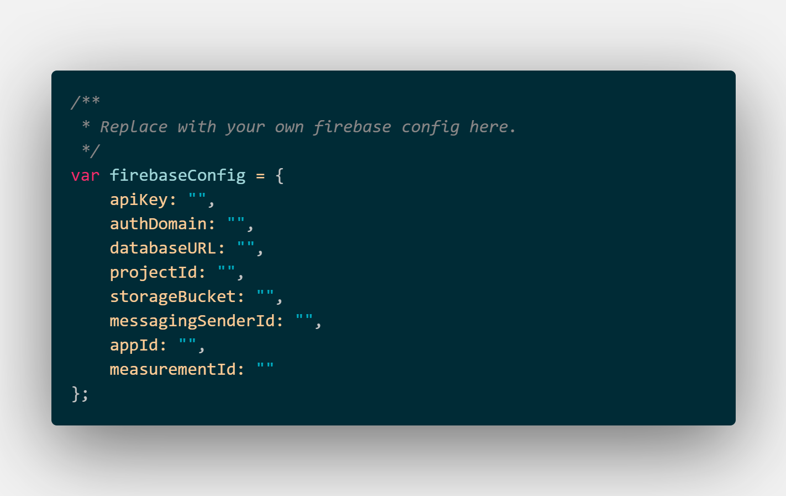

# MCU IoT 10902 Raspberry pi 微學分課程

# 使用說明
這是一個用網站結合firebase控制樹梅派GPIO的實作專案。
```
git clone https://github.com/exkuretrol/MCU-IoT-10902-Raspberry-pi
cd MCU-IoT-10902-Raspberry-pi
npm install
```

記得把 `firebase_config.js` 裡面的設定改成自己的設定


